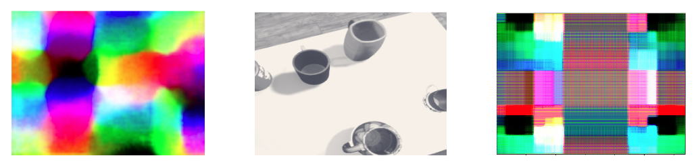
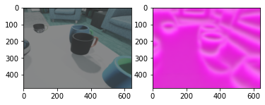

# Motivation

This project started as an attempt to facilitate the learning of dense descriptors as used by [Florence & Manuelli](https://arxiv.org/pdf/1806.08756.pdf) by inducing geometric equivalence through contrastive augmentation learning. My timeline and other focuses has changed this project into an exploration of descriptor learning and the benefits of different architectures on learning and deriving granular details.

The desire behind exploring dense descriptors stems from work I did with professor Chad Jenkins' lab on Affordance Coordinate Frames (ACF). The desire was to learn representations that can inform complex manipulation tasks and their constraints. An example is describing how one has to transport a full cup without spilling, or how one could pour out of such a cup. Since it is difficult to learn such representations without a prior, we were attempting to use dense descriptors space to learn relevant features.

Current results out of this work is not very promising but the intention is to evolve this to become a worthy starting point for others hoping to explore this domain. I also hope this ends up highlighting the distinction between dense descriptors and other spacial features like [SuperPoint](https://arxiv.org/abs/1712.07629)

# Current State

The project implements some invertible augmentation functions, sampling functions, foreground segmentation functions, and sets up two backbones (Atrous and Pyramidal) for generating dense descriptors. The dataloader is intended for previously labeled data intended for ACF learning but RGB images are sufficient for using this code.

Most recent results shown below indicate that the network is learning how to overcome the negative sample part of the loss by randomly varying the descriptor space as shown in images below. This motivates a better balancing between positive and negative sample loss as well as the use of more sophisticated geometric augmentations.

<figure>

<figcaption align = "center"><b>Fig.1  </b>Current state of descriptors. To the left is the descriptor generated by the Atrous backbone, in the center is the original augmented image, and the right most image is ne generated by the pyramidal network with multi-layer loss.</figcaption>
</figure>

As evident by previous work on self-supervised descriptor learning, the earlier results shown below prove that with some loss tuning the network should be able to learn.

<figure>

<figcaption align = "center"><b>Fig.2  </b>Early results.</figcaption>
</figure>

# Using the code
The code is still evolving but the notebooks folder houses some easy to use demos. The code is half transitioned to using pytorch-lightning and weights and biases but some commented out code and old logging still persist.
The main training code resides in the main folder.

<!-- 

# This project is work in progress

Contributions thus-far: 
- Augmentation tools with de-augmentation and capabilities as well as the ability to apply similar augmentations on variously sized images. 
- An implementation of a simple dense net and set of pixel loss functions
- A training functionality capable of proving the insufficiency of simCLR augmentations for producing dense descriptors.

Next objective: 
- performing pixel wise contrastive learning on pyramidal (multi-scale) models.
- If successful the hope is to try and use positive samples only.

# Learning Dense Descriptors through Contrastive Methods and Augmentations.

## Big Picture: 

## Big pictures:
Zhen Zeng and Xiaotong Chen, members of the Lab for PROGRESS at university of michigan,  proposed and demonstrated the use of affordance coordinate frames for informing manipulation. Their work split the perception portion of the manipulation problem into two: deriving dense image descriptors, and learning affordance frames using those descriptors. Training the proposed network relies heavily on simulated data. Improving the work could be done by advancing descriptor derivation or learning the ACF vectors in a self-supervised/unsupervised manner.
## Recent Contributions: 
Xiaotong had recently proposed using the method by [Florence & Manuelli] to derive descriptors for the purpose of helping generalize affordance coordinate frame learning. Over the past couple of months I have been helping Xiaotong and Kaizhi Zheng advance their work by: 
Developing an evaluation method to assess descriptor generalizability. That method centers objects of the same category and associates their pixels then measures the distances between descriptors of those associated pixels.
Attempting (and failing) to use the intra-category association to build more general descriptors. So far this has been causing the descriptor space to collapse into a trivial solution.
Training a feature-pyramid-network as a backbone, using the same method proposed by [Florence & Manuelli]. Because that backbone is more commonly used in cases where there are objects of interest with various sizes.
Apart from that, I have been exploring literature on manipulation and perception by reading about descriptor learning, semantically informed manipulation, and learning from demonstration. A few of the papers I read inspired the proposal below.
## Learn descriptors using contrastive learning:
Recent work using contrastive learning proved that by comparing augmented views of human hands we are able to learn features that allow us to better perform hand pose estimation [Spurr & Dahiya]. The insight of this work was that geometric augmentations (e.g. rotation) should translate to a similar augmentation in feature space. Issue is that this requires iconic views (views of a single object) or at least bounding boxes on objects of interest. Other recent work has shown promising result training a network to perform object detection using non-iconic images [Liu]. Can we use contrastive learning methods to extract features that are meaningful in a manipulation pipeline, using natural non-iconic images?.
Motivation
Unsupervised dense descriptors can help generalize learned manipulation protocols (e.g. ACF) of intra category objects without having to explicitly label each instance. Current state of the art uses pixel level comparison [Florence & Manuelli] [Unsupervised Learning of Dense Visual Representations]. From some experiments we ran on the work by [Florence & Manuelli], we saw that different instances of objects of the same category do not necessarily develop similar feature distributions (that is based on simulator generated images of different mugs). The use of augmentations, that are central in contrastive learning, might encourage similarity in descriptors of objects of the same category.
Contrastive learning is easy to transfer to real world applications when it does not require object reconstruction and pixel level associations. Some current methods require 3D reconstruction of objects and performing association and dissociation, which ends up being complicated and expensive.
## Intended Exploration Directions: 
Current work could be improved by: 
Learning from non-iconic cluttered images through either using single views or possibly using a method similar to [Liu] leveraging RGB association and different resolutions. 
Using positive only samples as is done by SimSiam or SimCLR. That would allow for easier and possibly perpetual learning.
## Evident difficulties: 
The paper by [Liu] uses plenty of data to learn from non-iconic images. That said, the work does rely on association solely using RGB similarity, we might be able to improve sample efficiency by using more robust association methods leveraging camera pose and image features.
Code is not available for [Spurr & Dahiya] or [Liu] so the methods will need to be reimplemented. 
What work needs to be done?
More extensively and closely review literature and method implementations. 
Collect or identify the data needed.
Re-implement required functions for geometrically equivariant transformations.
Experiment with the use of an FPN and different resolutions to attempt to find transformations to build associations using non-iconic images (ones with many objects)**
Build a more standard evaluation method to evaluate the extent of how useful the produced features are.
Tangential experimentation: Explore the use of view augmentation for making the method presented by [Florence & Manuelli] more generalizable.
 -->

<!-- 
# How to run this!

Simply run python main.py to train

To use tensorboard run: tensorboard --logdir=runs -->